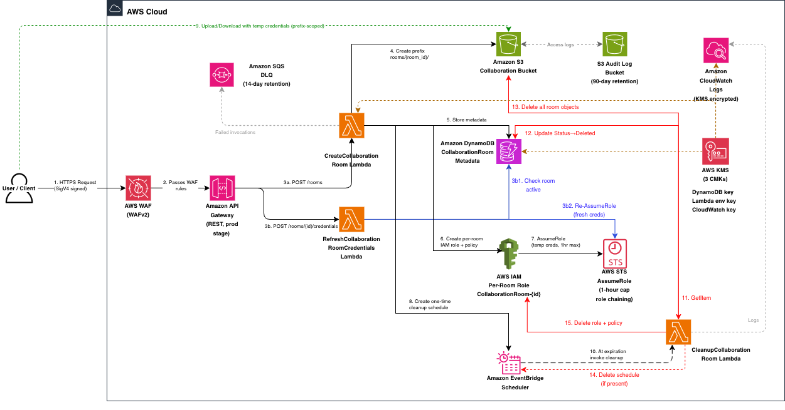

# Ephemeral Collaboration Rooms

Automated time-bound secure data sharing infrastructure on AWS.

## Overview

This project provisions a secure, ephemeral data-collaboration system as a single
AWS CloudFormation stack. Each "room" is an S3 prefix with a dedicated, prefix-scoped
IAM role. Callers receive short-lived STS credentials to read/write only their room's
objects, and every room is automatically torn down at its expiration time.

The entire stack is defined in [`ephemeral-collaboration-rooms.yaml`](ephemeral-collaboration-rooms.yaml).

## How it works

1. **Create a room** — A caller sends an IAM-signed (SigV4) `POST /rooms` request. The
   `CreateCollaborationRoom` Lambda:
   - allocates a `room_id` (UUID) and an S3 prefix `rooms/<room_id>/`,
   - writes room metadata to DynamoDB (with a TTL set to the expiration time),
   - creates a per-room IAM role `CollaborationRoom-<room_id>` with an inline policy
     scoped to that prefix only,
   - assumes that role and returns temporary STS credentials, and
   - registers a **one-time EventBridge Scheduler** schedule that fires at expiration.

   If any step fails, a compensating rollback deletes whatever was partially created
   (IAM role, schedule, S3 prefix marker, DynamoDB row).

2. **Use the room** — With the returned credentials, the caller reads/writes objects
   under `rooms/<room_id>/` in the collaboration bucket.

3. **Refresh credentials** — Issued credentials are capped at **1 hour** (see below),
   which is usually shorter than the room's lifetime. To keep working, callers request
   a fresh credential set via `POST /rooms/{room_id}/credentials`, handled by the
   `RefreshCollaborationRoomCredentials` Lambda. It re-assumes the still-existing
   per-room role and returns new short-lived credentials, provided the room is still
   `Active` and not expired.

4. **Cleanup** — At expiration, EventBridge Scheduler invokes the
   `CleanupCollaborationRoom` Lambda, which deletes the room's S3 objects, marks the
   DynamoDB metadata `Deleted`, deletes the per-room IAM role and inline policy, and
   deletes the schedule (the schedule is also `ActionAfterCompletion='DELETE'`, so it
   self-removes after firing). DynamoDB TTL and an S3 lifecycle rule act as backstops.

> **Note on credential duration.** The create/refresh Lambdas run under an assumed
> role, so their `AssumeRole` call is *role chaining*, which AWS hard-caps at **1 hour**
> regardless of the role's `MaxSessionDuration`. The effective credential duration is
> therefore `min(room lifetime, MaxCredentialDurationHours, 1 hour)`. Use the refresh
> endpoint to obtain new credentials for rooms that live longer than an hour.

## Architecture



### Architecture Flow

**Room Creation (Steps 1–8):**

1. User sends `POST /rooms` request with `requester_email`, `lifetime_hours`, and `description` (SigV4 signed).
2. AWS WAF evaluates the request against managed rule groups (Common Rules, Known Bad Inputs, IP rate limit). If it passes, the request proceeds to API Gateway.
3. API Gateway authenticates using AWS IAM (SigV4) and invokes the `CreateCollaborationRoom` Lambda function.
4. CreateRoom Lambda generates a unique Room ID (UUID) and creates an isolated S3 prefix (`rooms/{room_id}/`) in the Collaboration Bucket.
5. CreateRoom Lambda stores room metadata in DynamoDB including RoomId, RequesterEmail, CreatedAt, ExpirationTime, LifetimeHours, Description, S3Prefix, and Status ("Active").
6. CreateRoom Lambda creates a dedicated per-room IAM role (`CollaborationRoom-<room_id>`) with an inline policy scoped to that room's S3 prefix only (`s3:GetObject`, `s3:PutObject`, `s3:ListBucket` with prefix condition).
7. CreateRoom Lambda calls AWS STS `AssumeRole` on the per-room role to generate temporary credentials. Due to role chaining, credential duration is capped at **1 hour** regardless of other settings.
8. CreateRoom Lambda creates an EventBridge Scheduler one-time schedule using an `at()` expression set to the expiration timestamp, targeting the `CleanupCollaborationRoom` Lambda with Room ID. The schedule is configured with `ActionAfterCompletion: DELETE` to self-remove after firing.

**Response returned to user:** room_id, s3_prefix, bucket_name, expiration_time, and temporary credentials (AccessKeyId, SecretAccessKey, SessionToken, Expiration).

**Data Access (Step 9):**

9. User uploads/downloads files to/from the room's S3 prefix using the temporary credentials. Access is restricted exclusively to `rooms/{room_id}/*` — any attempt to access other prefixes or buckets returns AccessDenied.

**Credential Refresh (when credentials expire ~1 hour):**

User sends `POST /rooms/{room_id}/credentials` → API Gateway → `RefreshCollaborationRoomCredentials` Lambda → checks DynamoDB (room must be Active and not expired) → calls STS `AssumeRole` on the per-room role → returns fresh 1-hour credentials to user.

**Automated Cleanup (Steps 10–15, triggered at expiration):**

10. EventBridge Scheduler fires at the room's expiration time and invokes the `CleanupCollaborationRoom` Lambda with the Room ID.
11. CleanupRoom Lambda executes GetItem on DynamoDB to retrieve S3Prefix and Status.
12. CleanupRoom Lambda updates DynamoDB record changing Status from "Active" to "Deleted". DynamoDB TTL eventually removes the record.
13. CleanupRoom Lambda uses ListObjectsV2 with pagination to enumerate objects, then deletes in batches using DeleteObjects API (up to 1,000 per request).
14. CleanupRoom Lambda verifies the EventBridge Scheduler one-time schedule has self-deleted (`ActionAfterCompletion: DELETE`). If still present, explicitly deletes it using DeleteSchedule API.
15. CleanupRoom Lambda deletes the per-room IAM role (`CollaborationRoom-<room_id>`) by first removing the inline policy using DeleteRolePolicy, then deleting the role using DeleteRole.

### Components

- **Amazon S3** — Two buckets: the collaboration bucket (AES256 encryption, versioning, object
  lock, lifecycle expiry, public access blocked) and a separate audit-log bucket
  (`<bucket>-audit-logs`, 90-day retention) that receives the collaboration bucket's
  server access logs. Both enforce TLS via bucket policy.
- **Amazon DynamoDB** — `CollaborationRoomMetadata` table tracks room metadata.
  KMS-encrypted, with TTL, point-in-time recovery, and streams enabled.
- **AWS Lambda** — Three functions: `CreateCollaborationRoom`,
  `RefreshCollaborationRoomCredentials`, and `CleanupCollaborationRoom`.
  Environment variables are KMS-encrypted; failures route to an SQS dead-letter queue.
- **Amazon API Gateway** — Regional REST API `CollaborationRoomsAPI` (stage `prod`) with
  `AWS_IAM` authorization, access logging, X-Ray tracing, and a throttling usage plan.
- **AWS WAF (WAFv2)** — Web ACL on the API stage with AWS managed rule groups
  (Common, Known Bad Inputs) and an IP-based rate-limit rule (2000/IP per 5-min window).
- **Amazon EventBridge Scheduler** — One-time `at()` schedule per room for cleanup,
  with `ActionAfterCompletion: DELETE` for automatic self-removal.
- **AWS IAM** — A per-room role (`CollaborationRoom-<room_id>`) for prefix-scoped access,
  a Lambda execution role, and a scheduler execution role used by EventBridge Scheduler
  to invoke the cleanup Lambda.
- **AWS KMS** — Three customer-managed keys (with rotation enabled) for DynamoDB,
  Lambda environment variables, and CloudWatch Logs.
- **Amazon SQS** — `CollaborationRooms-DLQ` dead-letter queue (SSL-enforced, 14-day
  retention) for the Lambda functions.

## API

All endpoints require IAM (SigV4) authentication. The API base URL is the `ApiEndpoint`
stack output and already includes the `prod` stage.

| Method & path                     | Handler                                | Purpose                                   |
| --------------------------------- | -------------------------------------- | ----------------------------------------- |
| `POST /rooms`                     | `CreateCollaborationRoom`              | Create a room and return credentials      |
| `POST /rooms/{room_id}/credentials` | `RefreshCollaborationRoomCredentials`  | Issue fresh credentials for an active room |

Cleanup runs on a schedule and is not exposed as an API route.

## Prerequisites

- AWS CLI configured with credentials that can create CloudFormation stacks and the
  resources above (S3, DynamoDB, Lambda, API Gateway, IAM, KMS, SQS, WAF, EventBridge
  Scheduler)
- Bash shell and `jq` (used by `create-room.sh`)

## Deployment

Run the scripts from the repository root. `deploy.sh` and the room/stack helpers live in
`examples/`; `verify-stack.sh` is at the root.

1. Deploy the CloudFormation stack:
```bash
./examples/deploy.sh <stack_name> [bucket_name]
```

Example:
```bash
./examples/deploy.sh my-collab-stack my-collab-bucket
```

If the bucket name is omitted, it defaults to `name_of_your_bucket-<account_id>`.
The script deploys with `DefaultRoomLifetimeHours=24` and `MaxCredentialDurationHours=12`
and leaves `ConfigureApiGatewayAccount=false` (see below).

2. Verify the deployment:
```bash
./verify-stack.sh <stack_name> [region]
```

### Account-level API Gateway logging

API Gateway access logging requires a one-time, account-level CloudWatch Logs role.
If this account has never had that role configured, deploy once with the
`ConfigureApiGatewayAccount=true` parameter to create it. Leave it `false` if another
stack in the account already configures it, to avoid conflicts.

## Usage

Create a new collaboration room (edit the email/description placeholders in the script
first):
```bash
./examples/create-room.sh <stack_name>
```

Or call the API directly with SigV4-signed requests:
```bash
# Create a room
curl -X POST "<api-endpoint>/rooms" \
  --aws-sigv4 "aws:amz:<region>:execute-api" \
  --user "<access_key>:<secret_key>" \
  -H "Content-Type: application/json" \
  -d '{
    "requester_email": "user@example.com",
    "lifetime_hours": 24,
    "description": "Project collaboration"
  }'

# Refresh credentials for an existing room
curl -X POST "<api-endpoint>/rooms/<room_id>/credentials" \
  --aws-sigv4 "aws:amz:<region>:execute-api" \
  --user "<access_key>:<secret_key>"
```

The response includes the room's S3 prefix, bucket name, expiration time, and a set of
temporary credentials (access key, secret key, session token). Store them securely —
they are not retrievable later. Use them to upload/download objects under the room's
prefix, e.g.:
```bash
AWS_ACCESS_KEY_ID=<access_key> \
AWS_SECRET_ACCESS_KEY=<secret_key> \
AWS_SESSION_TOKEN=<session_token> \
aws s3 cp ./myfile.txt s3://<bucket_name>/<s3_prefix>myfile.txt
```

### Request parameters (`POST /rooms`)

| Field             | Type    | Required | Notes                                                            |
| ----------------- | ------- | -------- | ---------------------------------------------------------------- |
| `requester_email` | string  | yes      | Non-empty string                                                 |
| `lifetime_hours`  | integer | no       | 1 to `DefaultRoomLifetimeHours` (default 24); defaults to the max |
| `description`     | string  | no       | Up to 1024 characters                                            |

## Resource Names

**User-defined (dynamic):**
- Stack name (provided during deployment)
- S3 bucket name (provided during deployment; audit-log bucket is `<bucket>-audit-logs`)

**Fixed (hardcoded):**
- DynamoDB table: `CollaborationRoomMetadata`
- Lambda functions: `CreateCollaborationRoom`, `RefreshCollaborationRoomCredentials`,
  `CleanupCollaborationRoom`
- API Gateway: `CollaborationRoomsAPI` (stage `prod`)
- SQS dead-letter queue: `CollaborationRooms-DLQ`
- WAF Web ACL: `CollaborationRoomsApiWaf`
- IAM roles (per room): `CollaborationRoom-<room_id>`
- EventBridge Scheduler schedules (per room): `CollaborationRoom-Cleanup-<room_id>`

## Configuration

CloudFormation template parameters:
- `CollaborationBucketName` — name for the collaboration S3 bucket (required)
- `DefaultRoomLifetimeHours` — default/maximum room lifetime in hours, 1–168 (default 24)
- `MaxCredentialDurationHours` — cap on STS credential duration in hours, 1–12
  (default 12; note the effective cap is 1 hour due to role chaining)
- `ConfigureApiGatewayAccount` — `true`/`false` (default `false`); set once per account
  to configure account-level API Gateway CloudWatch logging

## Cleanup

Delete the stack (empties both buckets first, with confirmation):
```bash
./examples/delete-stack.sh <stack_name>
```

## Security Features

- Customer-managed KMS encryption for DynamoDB, Lambda environment variables, and
  CloudWatch Logs; SSE-S3 (AES256) for S3 buckets
- TLS enforced in transit via S3 and SQS bucket/queue policies
- S3 versioning, object lock, and public-access block
- AWS WAF managed rule groups plus IP rate limiting on the API
- API Gateway IAM (SigV4) authorization, access logging, X-Ray tracing, and throttling
- Per-room, prefix-scoped temporary IAM credentials
- Lambda dead-letter queue and reserved concurrency
- Audit/access logging (90-day retention)
- Automatic cleanup via EventBridge Scheduler, DynamoDB TTL, and S3 lifecycle rules

See [SECURITY.md](SECURITY.md) for known considerations, limitations, and production
hardening guidance.
